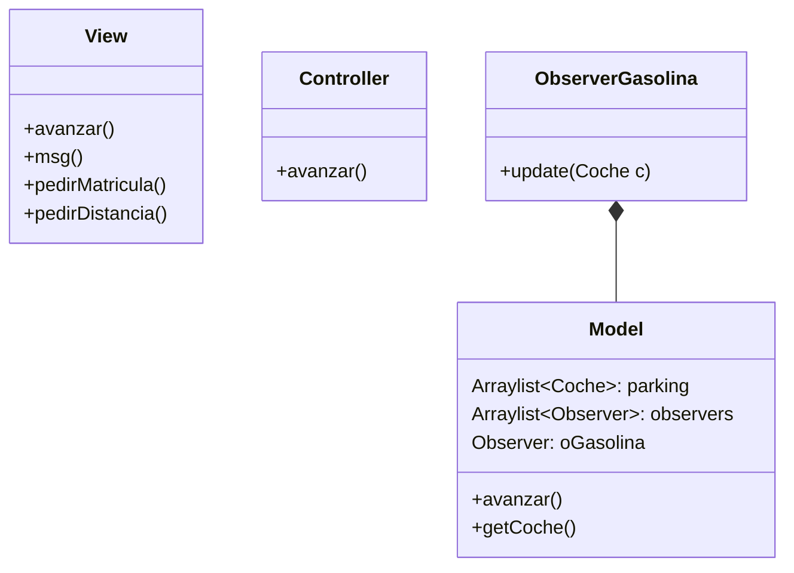
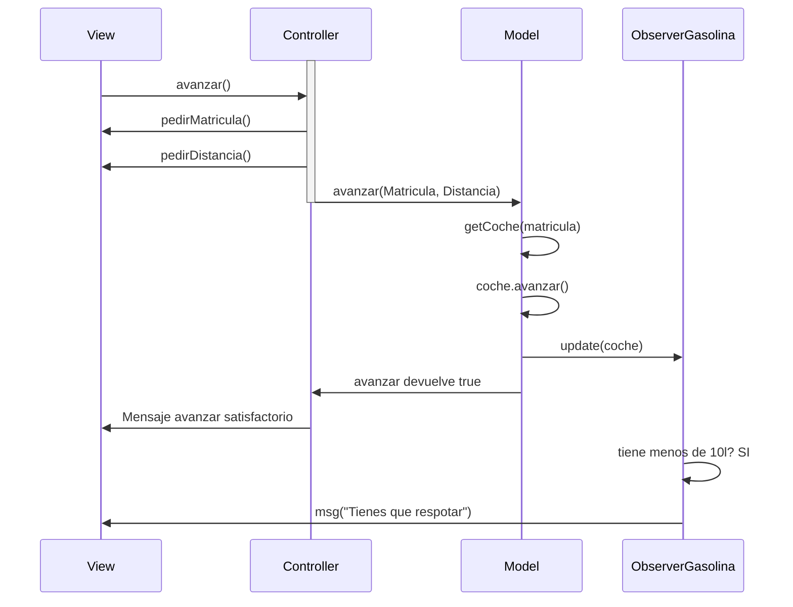

### !! Tuve que refactorizar el ejercicio casi escribiendo el codigo desde cero otra vez porque el que entregue estaba bastante mal hecho al no entender bien el MVC. La funcionalidad es la misma y parto desde el primer commit. 

--- 

## Implementacion
Para implementar la distancia y la gasolina, he seguido el siguiente "recorrido"
1.  He implementado en la View las opciones en el menú, que me ayudarán a saber que funciones hacer
2.  Despues, escribí las funciones que necesité usar en View en el Controller, que son `echarGasolina()` y `avanzar()`. Estas se comunican con View para pedir los datos usando las funciones `pedirGasolina()`, `pedirMatricula()`, etc.
3.  Codifiqué la logica de esas funciones de Controller en el Model tal cual como se describieron en el pseudocódigo. La función `avanzar()` la hice propia de la clase coche ya que me hacía mas sentido que estuviese ahí, por lo que solamente buscan el coche por la matricula y cambian las variables de cada objeto coche buscandolo por matricula con el metodo `getCoche()`. 

## Diagrama de clases

## Diagrama de secuencia aviso gasolina

